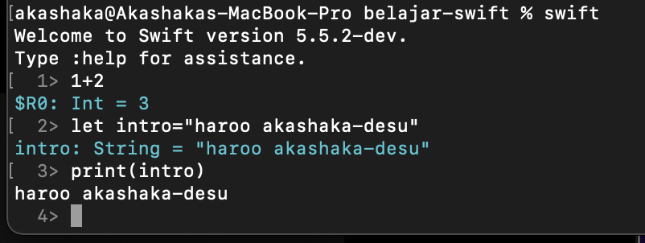

# belajar-swift
- Apa itu Swift
bahasa swift adalah bahasa pemrograman yang dikembangkan oleh apple inc. bahasa ini menjadi bahasa pengantar bagi mac developer,ios, watch os,dan platform apple lainnya. bahasa swift merupakan pengembangan dari bahasa Objective-c. selain itu Swift merupakan bahasa pemrograman yang modern, cepat, dan type-safe.
referensi pengenalan swift
https://medium.com/@rizal_hilman/swift-intro-apa-itu-bahasa-pemrograman-swift-b33ea3ce1a43
https://www.codepolitan.com/mengenal-swift-bahasa-pemrograman-untuk-teknologi-apple-589a92b4c2389
- Menggunakan REPL 
ha,rekayasa perangkat lunak atau rpl?. bukan-bukan, ini REPL atau Read Eval Print Loop adalah sebuah fitur untuk membaca, mengevaluasi, mencetak dan mengulang script dari suatu bahasa top-level. dalam bahasa swift penggunaan repl hanya perlu mengetikan perintah "swift" dan klik enter maka secara otomatis akan memasuki fitur repl milik swift.
contoh penggunaan repl

selain untuk mencoba kode program dengan bahasa swift kamu juga dapat secara otomatis menyarankan fungsi dan metode yang dapat digunakan dalam konteks tertentu. contoh penggunaannya
ketik => "Hi!".re 
lalu tekan tab
```
5> "Hi!".re
Available completions:
	remove(at: Index) -> Character
	removeAll() -> Void
	removeAll(keepingCapacity: Bool) -> Void
	removeSubrange(bounds: ClosedRange<Index>) -> Void
	removeSubrange(bounds: Range<Index>) -> Void
	replaceSubrange(bounds: ClosedRange<Index>, with: C) -> Void
	replaceSubrange(bounds: ClosedRange<Index>, with: String) -> Void
	replaceSubrange(bounds: Range<Index>, with: C) -> Void
	replaceSubrange(bounds: Range<Index>, with: String) -> Void
	reserveCapacity(n: Int) -> Void

```
- inisialisasi package executeable swift
untuk latihan pertama kita akan membuat sebuah folder bernama "Latihan" untuk package Latihan
```
mkdir Latihan
cd Latihan
```
lalu kita inisialisasi package executablenya
```
swift package init --type executable
```
secara default jika dijalankan dengan command 'swift run' maka script akan melakukan print "Hello, world!"

- variable dan const 
untuk melakukan deklarasi variable pada swift gunakanlah keyword var dan untuk deklarasi constant value gunakanlah let
contoh penggunaan
```
var myVariable = 42
myVariable = 50
let myConstant = 42
```
explicit type infersion, ketika mendeklarasikan variable kamu bisa menetapkan tipe data secara eksplisit sepert:
```
var nama: String = "akashaka"
var hariKe: Int = 2
```
nilai sebuah variable tidak pernah secara implisit di konvert menjadi tipe data yang sesuai, jadi kamu harus secara eksplisit mengubahnya, seperti:
```
let label = "The width is "
let width = 94
let widthLabel = label + String(width)
```
kamu bisa memuat nilai dari suatu variabel menjadi string dan memuatnya kedalam suatu string dengan cara seperti
```
let apples = 3
let oranges = 5
let appleSummary = "I have \(apples) apples."
let fruitSummary = "I have \(apples + oranges) pieces of fruit."
```

- array dan dictionaries
```
var testArray=["ayam goreng","rendang"]
var testArrayExplicit: String =["nasi goreng","es cendol"]
testArrayExplicit.append("ayam bakar")
var testDict=["nama":"akashaka","kelas":5]
var testDictExplicit: [String:String]=["nama":"nama","kelas":"5"]
var testDictExplicit["nama_lain":"shan"]
```
